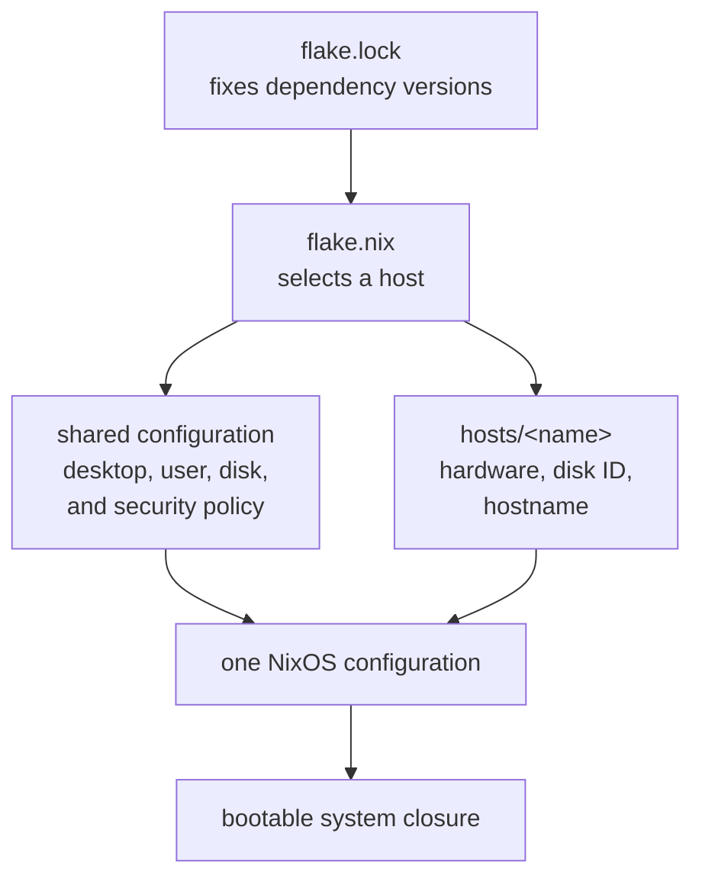
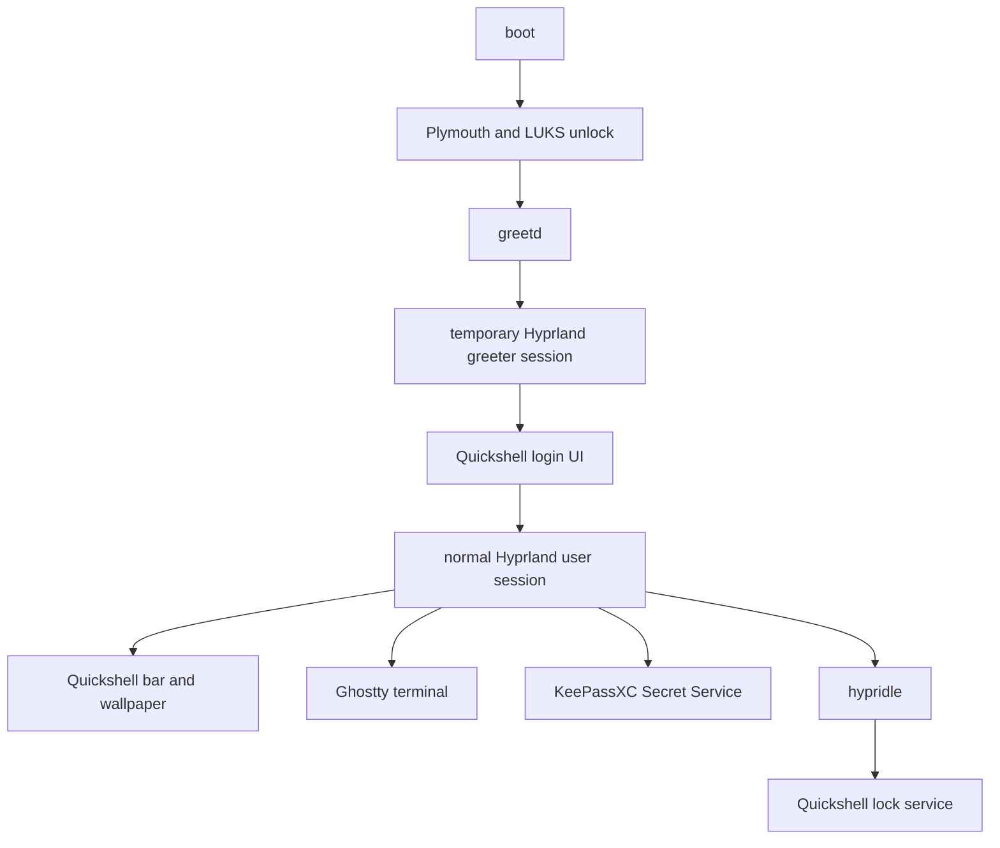

# How this repository works

This document assumes no prior Nix or NixOS knowledge. Read it from top to
bottom once; afterward, use the file guide and change recipes as a reference.

## The one-sentence mental model

NixOS builds a complete operating system by merging small configuration files
called modules. This repository selects a machine, merges its host-specific
facts with shared modules, and produces one bootable system.

The main data flow is:



A “closure” is the complete set of files required by a built system. Building a
closure proves that every referenced package and configuration can be produced;
it does not install or boot the result.

## Vocabulary

| Term | Meaning in this repository |
| --- | --- |
| Nix | The package manager and configuration language |
| NixOS | Linux whose operating-system configuration is built by Nix |
| Flake | The repository entry point, its dependencies, and its named outputs |
| Input | An external dependency such as Nixpkgs, Disko, or Home Manager |
| `flake.lock` | Exact revisions of every input |
| Module | A Nix file that declares part of the desired system |
| Host | A machine with a hostname and architecture |
| Nixpkgs | The package collection and NixOS module library |
| Disko | The module and tool that partitions, encrypts, and mounts disks |
| Home Manager | The module that configures Igor's user session |
| systemd-boot | The UEFI boot menu installed and managed through Lanzaboote |
| Lanzaboote | Builds, signs, and installs the machine's boot artifacts |
| Plymouth | Draws the graphical boot and encrypted-disk prompt |
| BGRT | Plymouth theme that preserves the firmware's boot logo when available |
| UEFI | The firmware interface that starts the bootloader |
| TPM | Hardware or virtual hardware that can unlock LUKS after trusted boot |

## How to read the Nix files

Most files in this repository are NixOS modules with this shape:

```nix
{ pkgs, ... }:

{
  programs.example.enable = true;
  environment.systemPackages = [ pkgs.example ];
}
```

The first `{ ... }:` receives values supplied by NixOS. The second attribute
set declares the desired settings. Useful syntax:

| Syntax | Meaning |
| --- | --- |
| `name = value;` | Assign an option; every assignment ends with `;` |
| `[ a b ]` | A list |
| `{ a = 1; }` | An attribute set, similar to a dictionary |
| `./file.nix` | A path relative to the current file |
| `imports = [ ... ];` | Merge other modules into this one |
| `${value}` | Insert a Nix value into a string |
| `# comment` | An explanation ignored by Nix |
| `lib.mkDefault` | Provide a value that a more specific module may override |
| `lib.mkForce` | Deliberately override another module's value |

Dots in an option name describe nesting. For example,
`networking.networkmanager.enable = true` enables the `enable` option inside
the `networkmanager` section inside `networking`.

Multiple modules may set different parts of the same section. NixOS merges
those declarations and reports conflicts rather than silently choosing based
on file order.

## Why the hostname omits the architecture

`igor-desktop` names a specific machine. Architecture is separate machine
metadata recorded in `flake.nix`, not part of the hostname.

The configuration does not change identity during Secure Boot setup. Instead,
Lanzaboote handles the temporary first-boot state:

1. install the final host configuration while Secure Boot is disabled;
2. boot unsigned artifacts once and generate machine-local signing keys;
3. rebuild the same configuration and verify its signatures;
4. enroll the keys in firmware;
5. verify Secure Boot;
6. enroll TPM-assisted disk unlock.

`autoGenerateKeys` makes Lanzaboote permit unsigned artifacts while its key
bundle is absent, then creates the bundle under `/var/lib/sbctl` after the
first boot. Automatic firmware enrollment stays disabled: the user must verify
the signed artifacts before changing firmware trust. The configuration retains
eight generations and measures PCRs 4 and 7 for the TPM policy.

## How a host is assembled

`flake.nix` is the entry point. For `igor-desktop` it combines:

1. Disko's NixOS module;
2. Home Manager's NixOS module;
3. Lanzaboote's NixOS module;
4. `configuration.nix`, the shared operating-system and desktop settings;
5. `home.nix`, Igor's shared user-session settings;
6. `modules/boot/secure-boot.nix`, the shared boot policy; and
7. `modules/boot/splash.nix`, the shared graphical boot; and
8. `hosts/<name>/default.nix`, the machine-specific facts.

The `nixosConfigurations.igor-desktop` output sets the system to
`x86_64-linux` and the host module to `hosts/igor-desktop/default.nix`.

CI evaluates those values and rejects a build whose declared hostname or CPU
architecture does not match what the job expects.

## Shared and host-specific configuration

Shared configuration belongs at the repository root or under `modules/`:

- `configuration.nix` configures networking, locale, the user account,
  Hyprland, greetd, Quickshell, and Nix itself.
- `home.nix` configures files and services owned by Igor rather than by the
  whole operating system.
- `modules/storage/luks-btrfs.nix` describes the disk layout.
- `modules/boot/secure-boot.nix` contains the one shared boot policy.
- `modules/boot/splash.nix` enables Plymouth's BGRT splash and password prompt.

Only facts about the specific machine belong under `hosts/<name>/`:

- hostname;
- target architecture;
- stable installation-disk identifier; and
- generated kernel and hardware information.

This boundary answers the usual placement question: a setting that describes
the computer in general is shared; a fact that describes this particular
machine — its hardware, its disk, its hostname — is host-specific.

The shared system settings are:

| Setting | What it does |
| --- | --- |
| NetworkManager | Manages wired and wireless networking |
| Europe/Berlin timezone | Sets the system clock presentation |
| English/German locale mix | Uses English text and German regional formats |
| Unfree packages | Allows packages whose licenses Nixpkgs marks unfree |
| User `igor` | Creates the user in `wheel` and `networkmanager` groups |
| zram swap | Uses compressed RAM as swap before relying on disk |
| Hyprland, Qt, and dconf | Provides the Wayland desktop foundations |
| greetd and Quickshell | Provides the graphical login flow |
| Tracked wallpaper | Provides one background for the desktop, login, and lock screen |
| Git LFS | Keeps the installed wallpaper checkout usable |
| Nix flakes | Enables the command and flake interfaces used here |
| `stateVersion` | Keeps compatibility defaults stable across upgrades |

Home Manager owns:

| Setting | What it does |
| --- | --- |
| Hyprland and Quickshell files | Installs the user's desktop files |
| Quickshell lock service | Gives every lock request one idempotent service |
| KeePassXC | Starts automatically and provides the Secret Service API |
| Ghostty | Provides the configured terminal |
| hypridle | Locks after 5 minutes and blanks displays 30 seconds later |

## Storage and hardware

Each host tracks two machine facts:

- `disk-device` is the stable `/dev/disk/by-id/...` path used only when Disko
  partitions that machine.
- `hardware-configuration.nix` is generated by
  `nixos-generate-config --no-filesystems`.

The `--no-filesystems` rule is important. Disko is the only owner of
partitions, filesystems, and mount points, so generated hardware data cannot
silently disagree with the declared layout.

The shared layout is:

| Layer | Result |
| --- | --- |
| GPT partition table | One EFI partition and one encrypted partition |
| EFI partition | 1 GiB FAT filesystem mounted at `/boot` |
| LUKS2 partition | Encrypted container named `cryptroot` |
| Btrfs | Separate `/`, `/home`, and `/nix` subvolumes |

The EFI filesystem uses `umask=0077` so ordinary users cannot read its files.
Btrfs uses Zstandard compression and `noatime` to reduce space and metadata
writes. LUKS permits discards so SSD and sparse-VM storage can reclaim unused
blocks; the tradeoff is that the storage layer may reveal which encrypted
blocks are unused.

The committed placeholder hardware file makes a fresh checkout evaluable. The
installer replaces it with the real scan during installation.

## What the installer does

`install.sh` is intentionally more defensive than the rest of the repository
because it destroys a disk. Its work is divided by the confirmation boundary.

The graphical ISO includes Nix but may leave its flake interfaces disabled.
The installer enables `nix-command` and `flakes` through its own process
environment, which also covers the Nix commands it starts without editing the
live system's configuration.

Before confirmation it:

1. requires root and UEFI;
2. checks that `/mnt` is unused;
3. requires a clean Git checkout and committed lock file;
4. evaluates the selected host configuration;
5. rejects a live ISO with the wrong CPU architecture;
6. lists every whole-disk `/dev/disk/by-id/...` path with identifying details;
7. asks which complete identifier to erase; and
8. rejects mounted, active, or non-disk selections.

The user must type the complete stable disk identifier as part of the
confirmation. Nothing destructive runs before that succeeds.

After confirmation it:

1. copies the exact checked-out commit to a temporary directory;
2. obtains Git LFS from the locked Nixpkgs input and downloads tracked assets;
3. writes the selected disk identifier into that copy;
4. reads and confirms the login and LUKS secrets without echoing them;
5. sends the LUKS passphrase over standard input to the locked Disko tool,
   skips Disko's now-redundant second wipe confirmation, partitions, encrypts,
   and mounts the disk, then verifies all four target mount points;
6. clears the LUKS passphrase from the shell;
7. moves the copied repository into the target user's home;
8. generates hardware data without filesystems;
9. installs the selected host configuration and verifies its system profile,
   fallback EFI bootloader, and NixOS boot image;
10. sends the login password to `chpasswd` over standard input; and
11. saves the detailed subcommand log, flushes disk writes, and clears
    temporary password variables and files.

The password, its hash, and the LUKS passphrase are never written to Git or
placed in command-line arguments. Routine subcommand output is written to the
installation log. On an interactive terminal, one short status row is
replaced with the latest output line so long operations remain visibly active
without filling the screen.

## Desktop and login flow

The graphical path is:



System-owned greeter files are installed by `configuration.nix` under
`/etc/greetd`. The greeter and its shared QML components remain in one store
tree so relative imports work after Nix resolves `/etc` symlinks. User-owned
session files are installed by Home Manager from `home.nix`.

Both transitions into Hyprland use `start-hyprland`, Hyprland's supported
launcher. It prepares the session environment before starting the compositor;
the greeter additionally passes its small system-owned configuration file.
The greeter's compositor and Quickshell output is retained in the system
journal under the `greetd-greeter` identifier. A failed Quickshell startup
leaves its compositor in place instead of repeatedly restarting it; a
successful authenticated handoff exits it normally.

The lock screen is a systemd user service. Starting an already-running service
is safe, so keyboard, idle, and suspend events can all request a lock without a
process-detection race.

## Validation and CI

`flake.nix` contains no test derivations, lint package lists, formatter, or
development shell. It describes the machine and exposes the Disko command
used by the installer. Validation lives under `scripts/`, where it can be read
as an ordinary sequence of commands and cannot change the resulting computer.

The `validate-system` job calls `scripts/check-system.sh` with the hostname
and its expected Nix system, on a native x86_64 runner:

1. evaluate the hostname and architecture;
2. build the complete system closure.

Architecture-neutral work runs once in a separate `repository-quality` job.
`scripts/check-repository.sh` obtains its tools from the locked `nixpkgs` input
and then runs `scripts/check.sh`. That script checks Nix formatting and static
analysis, shell syntax and ShellCheck, installer tests, the current tree for
secrets, and QML with `qmllint`. It continues through independent checks so one
failure does not hide the others.

Here, `nix shell` only makes those tools available for one command. It does not
install them permanently or add them to either computer's configuration.

QML is checked statically with `qmllint`. CI deliberately does not launch the
complete Quickshell configurations: their `PanelWindow` and session-lock types
need a real Wayland compositor and its protocols, while an offscreen Qt process
has no window-system backend. Starting a nested compositor merely to make that
test pass would add infrastructure without reproducing the real login or lock
environment. The native system build already proves that the configured
Quickshell package can be produced; actual bar, greeter, and lock-screen
behavior remains a hardware acceptance test.

Another separate job scans the complete Git history for secrets.

CI cannot test firmware menus, Secure Boot enrollment, TPM behavior, GPU
initialization, or recovery passphrases. Those require the acceptance steps in
the installation and security guides.

## Secrets and generated state

Tracked:

- `flake.lock`;
- `hosts/*/disk-device`;
- `hosts/*/hardware-configuration.nix`.

Never tracked:

- login passwords or hashes;
- LUKS passphrases;
- Secure Boot private keys under `/var/lib/sbctl`;
- TPM enrollment state.

`lefthook.yml` can provide an optional local pre-commit Gitleaks scan when
`lefthook` and `gitleaks` are available. CI always scans both the current tree
and full Git history.

## File guide

| Path | Responsibility |
| --- | --- |
| `AGENTS.md` | Tool-neutral navigation and agent design rules |
| `flake.nix` | Dependencies, the system output, and the installer's Disko app |
| `flake.lock` | Exact dependency revisions |
| `configuration.nix` | Shared machine-wide settings |
| `home.nix` | Shared settings owned by Igor |
| `hosts/` | Per-machine facts |
| `modules/storage/` | Shared encrypted disk layout |
| `modules/boot/` | Shared Secure Boot, measured boot, and graphical splash |
| `dotfiles/hypr/` | Hyprland startup and key bindings |
| `dotfiles/quickshell/bar/` | User bar and wallpaper |
| `dotfiles/quickshell/greeter/` | Login screen |
| `dotfiles/quickshell/lockscreen/` | Lock screen |
| `dotfiles/quickshell/shared/` | Reused login and lock components |
| `wallpapers/` | Images installed by the shared system configuration |
| `install.sh` | Destructive installation workflow |
| `tests/` | Non-destructive installer unit tests |
| `scripts/check.sh` | Readable repository-level validation |
| `scripts/check-repository.sh` | Runs repository checks with locked tools |
| `scripts/check-system.sh` | Native validation for the desktop host |
| `.github/workflows/ci.yml` | Native system, repository quality, and history |
| `lefthook.yml` | Local pre-commit secret protection |
| `.gitignore` | Excludes local key files and Nix build links |
| `docs/` | Procedures and this explanation |

## Common change recipes

Add a system-wide package:

1. edit `environment.systemPackages` in `configuration.nix`;
2. run `scripts/check-repository.sh`;
3. run the matching `scripts/check-system.sh` command;
4. rebuild the intended host.

Add a user program or dotfile:

1. edit `home.nix`;
2. add its source under `dotfiles/` if necessary;
3. validate and rebuild.

Update dependencies:

1. run `nix flake update` inside NixOS;
2. review `flake.lock`;
3. run the repository and matching system check scripts;
4. commit `flake.lock` with the input change.

Change the disk layout:

1. edit `modules/storage/luks-btrfs.nix`;
2. review the change carefully: it is destructive-adjacent and hard to
   rehearse safely before running the installer for real.

## Design rules

- Prefer shared modules until a real host difference exists.
- Keep host facts next to that host.
- Keep one owner for each concern: Disko owns filesystems, hardware scans own
  detected hardware, and boot modules own boot policy.
- Keep Secure Boot enrollment manual and verify signatures before changing
  firmware trust.
- Keep destructive validation explicit even when it costs more lines.
- Do not add fleet tooling for a personal machine.
- Do not install Nix on macOS; use a NixOS VM as the development environment.

Upstream references:

- [NixOS manual](https://nixos.org/manual/nixos/stable/)
- [Disko](https://github.com/nix-community/disko)
- [Home Manager](https://nix-community.github.io/home-manager/)
- [Lanzaboote](https://nix-community.github.io/lanzaboote/)
